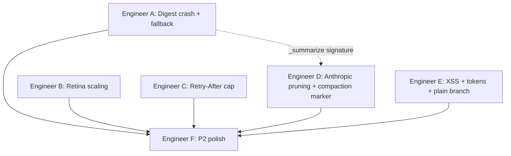

# Plan: Remediation Fixes for ComputerAgent — AI Engineer Assignments

Each engineer gets an independent, self-contained assignment with learning objectives. Engineers A–E work **in parallel**. Engineer F depends on A–E being merged first.

---

## Assignment A — `_mechanical_digest` Crash + Compaction Fallback Data Loss

**Engineer focus:** Defensive programming in error handlers; understanding that fallback paths are the *most critical* paths to test robustly.

**Files to modify:**
- `computer_agent/llm/context_manager.py` — lines 218 and 468–479
- `computer_agent/coordinator.py` — lines ~168–177
- `tests/test_context_manager.py` — add new tests

**Problem 1 — Line 218 crash:**
The `_mechanical_digest` function at line 218 does:
```python
parts.append("Key artifacts: " + ", ".join(dict.fromkeys(artifacts)[:10]))
```
`dict.fromkeys(artifacts)` returns a `dict`. You cannot slice a dict — it raises `KeyError(slice(None, 10, None))`. This crashes inside the `except LLMRateLimitError` block in the coordinator, killing the graceful error message.

**Fix:**
```python
parts.append("Key artifacts: " + ", ".join(list(dict.fromkeys(artifacts))[:10]))
```
The idiom `list(dict.fromkeys(x))` deduplicates while preserving insertion order, then `[:10]` slices the resulting list.

**Problem 2 — Coordinator hardening (line ~171):**
In `coordinator.py`, the `except LLMRateLimitError` handler calls `_mechanical_digest(self._conversation)` unprotected. If anything inside digest raises, the user gets an unhandled exception instead of the "progress so far" message.

**Fix:**
```python
except LLMRateLimitError as e:
    logger.error("coordinator_rate_limit", error=str(e), session=self.session_id)
    from computer_agent.llm.context_manager import _mechanical_digest
    try:
        digest = _mechanical_digest(self._conversation)
    except Exception as digest_err:
        logger.warning("digest_failed_in_handler", error=str(digest_err))
        digest = "(unable to summarize progress)"
    final_response = (
        f"Azure/LLM rate limit persisted after retries.\n\n"
        f"**Progress so far:**\n{digest}\n\n"
        f"**Error:** {e}\n\n"
        f"Resend your request to continue from where the agent left off."
    )
```

**Problem 3 — Compaction fallback (lines 476, 479):**
`_summarize()` currently falls back to `_mechanical_digest([])` — an empty list — which always returns `"No tool calls or errors recorded."`. The actual `middle` messages (the ones being compacted) are never passed.

**Fix — change `_summarize` signature:**
```python
async def _summarize(self, llm, transcript: str, fallback_messages: list[dict] | None = None) -> str:
    from computer_agent.config import settings
    model_override = settings.compaction_model or None
    try:
        resp = await llm.generate(
            messages=[{"role": "user", "content": _SUMMARY_PROMPT + "\n\n" + transcript}],
            system="You compress agent execution logs. Be factual and terse.",
            tools=None,
            max_tokens=1024,
            **({"model": model_override} if model_override else {}),
        )
        return resp.text or _mechanical_digest(fallback_messages or [])
    except Exception as e:
        logger.warning("compaction_summarizer_failed", error=str(e))
        return _mechanical_digest(fallback_messages or [])
```

Then in `compact()`, pass `middle` as fallback:
```python
summary = await self._summarize(llm, transcript, fallback_messages=middle)
```

**Tests to write:**
1. `test_mechanical_digest_with_paths_and_urls` — fixture messages must contain `/home/user/file.txt` and `https://example.com` → assert both appear in output.
2. `test_compact_fallback_preserves_tool_names` — stub LLM raises exception, assert `"some_tool" in compacted[0]["content"]` (not just "did not raise").

**Learning objectives:** Never trust that a fallback path is tested by "the tests pass." Write assertions on *output content*, not just absence of exceptions.

---

## Assignment B — Retina Coordinate Scaling

**Engineer focus:** Understanding the distinction between physical pixels and logical points in display systems; how coordinate spaces must be consistent end-to-end.

**Files to modify:**
- `computer_agent/tools/screen/screenshot.py` — `take_screenshot()` and `take_region_screenshot()`
- `computer_agent/llm/providers/litellm.py` — `format_tool_result_messages()`, lines ~265
- New or existing test file for screenshot metadata

**The problem:**
On macOS Retina, `pyautogui.screenshot()` captures at **pixel** resolution (2880×1800 for a 1440×900 display). The code downscales to `max_dimension=1440` and records `original_width=2880`. The LiteLLM provider then tells the model: *"screen is 2880×1800 — multiply coordinates by 2.0"*. But `pyautogui` mouse functions use **points** (1440×900 = `pyautogui.size()`). So the model computes `click(x*2, y*2)` → clicks at 2× the correct position.

**Fix — screenshot.py:**
```python
@tool(name="take_screenshot", ...)
def take_screenshot() -> ToolResult:
    try:
        from computer_agent.config import settings
        import pyautogui
        from PIL import Image
        screenshot = pyautogui.screenshot()
        ow, oh = screenshot.width, screenshot.height
        # Point dimensions = the coordinate space pyautogui mouse uses
        point_w, point_h = pyautogui.size()

        max_dim = settings.screenshot_max_dimension
        # Resize target should not exceed point dimensions (avoids >1 scale)
        target_max = min(max_dim, point_w)
        if max(screenshot.width, screenshot.height) > target_max:
            scale = target_max / max(screenshot.width, screenshot.height)
            screenshot = screenshot.resize(
                (int(screenshot.width * scale), int(screenshot.height * scale)),
                resample=Image.Resampling.LANCZOS,
            )

        screenshot = screenshot.convert("RGB")
        buf = io.BytesIO()
        screenshot.save(buf, format="JPEG", quality=settings.screenshot_jpeg_quality)
        b64 = base64.b64encode(buf.getvalue()).decode()
        return ToolResult.ok(
            output=b64,
            format="base64_jpeg",
            width=screenshot.width,
            height=screenshot.height,
            original_width=ow,
            original_height=oh,
            point_width=point_w,   # NEW
            point_height=point_h,  # NEW
        )
    except Exception as e:
        return ToolResult.fail(error=f"Screenshot failed: {e}")
```

**Fix — litellm.py `format_tool_result_messages`:**
Replace the scale calculation (currently `f"{ow / w:.2f}"`) with:
```python
# Use point dimensions (mouse coordinate space), not raw pixel dimensions
point_w = result.metadata.get("point_width", w)

if isinstance(w, int) and w == point_w:
    coord_note = "Mouse coordinates map 1:1 to this image."
else:
    scale_x = f"{point_w / w:.2f}" if isinstance(w, int) and w else "1.00"
    coord_note = f"Multiply image coordinates by {scale_x} to get mouse coordinates."

content_str = (
    f"Screenshot captured ({w}x{h} {'JPEG' if fmt == 'base64_jpeg' else 'PNG'}). "
    f"{coord_note} Image attached in the next message."
)
```

**Test to write:**
```python
def test_retina_scale_is_one_to_one():
    """On 2x Retina: 2880x1800 pixels, pyautogui.size()=(1440,900), max_dim=1440
       -> image is 1440x900, point_w=1440 -> scale message says '1:1'"""
    # Mock pyautogui.screenshot() to return 2880x1800 image
    # Mock pyautogui.size() to return (1440, 900)
    # Call take_screenshot()
    # Assert result.metadata["width"] == 1440
    # Assert result.metadata["point_width"] == 1440
    # Feed metadata into the litellm placeholder logic
    # Assert "1:1" in content_str (not "multiply by 2.0")
```

**Learning objectives:** Coordinate spaces in display systems are tricky — always verify by tracing a value from capture → resize → instruction → mouse action. The invariant is: `image_pixel_coord * scale == pyautogui_mouse_coord`.

---

## Assignment C — Retry-After Cap + `retry-after-ms` Header

**Engineer focus:** Defensive handling of server-provided hints; never trusting external input as unbounded numerical values.

**Files to modify:**
- `computer_agent/llm/providers/litellm.py` — `_acompletion_with_retry` (~line 146) and `_extract_retry_after` (~line 163)
- `tests/test_llm_retry.py` — add cap test

**The problem:**
Line 146: `delay = max(delay, retry_after_hint)` — if Azure returns `Retry-After: 3600`, the agent sleeps for 1 hour silently.

**Fix — cap the delay (line ~146):**
```python
if retry_after_hint is not None:
    delay = min(max(delay, retry_after_hint), settings.llm_retry_max_delay)
```

**Fix — parse `retry-after-ms` header:**
```python
def _extract_retry_after(self, e: Any) -> float | None:
    headers = getattr(getattr(e, "response", None), "headers", None) or {}
    # Azure uses retry-after-ms (milliseconds) — check first
    ms_val = headers.get("retry-after-ms") or headers.get("Retry-After-Ms")
    if ms_val:
        try:
            return float(ms_val) / 1000.0
        except (ValueError, TypeError):
            pass
    # Standard Retry-After (seconds)
    val = headers.get("retry-after") or headers.get("Retry-After")
    try:
        return float(val) if val else None
    except (ValueError, TypeError):
        return None
```

**Tests to write:**
```python
@pytest.mark.asyncio
async def test_retry_after_capped_at_max_delay(provider, fake_litellm):
    """Server sends retry-after: 3600 -> delay capped at llm_retry_max_delay (60s)."""
    delays: list[float] = []

    async def fake_acompletion(**kwargs):
        err = fake_litellm.RateLimitError("quota")
        err.response = MagicMock()
        err.response.headers = {"retry-after": "3600"}
        raise err

    async def fake_sleep(secs):
        delays.append(secs)

    fake_litellm.acompletion = fake_acompletion

    patches = _patch_settings(llm_max_retries=1, llm_retry_base_delay=2.0, llm_retry_max_delay=60.0)
    with patches[0], patches[1], patches[2], patch("asyncio.sleep", side_effect=fake_sleep):
        with pytest.raises(LLMRateLimitError):
            await provider._acompletion_with_retry(fake_litellm, {"model": "x", "messages": []})

    assert delays[0] <= 60.0  # capped, not 3600


@pytest.mark.asyncio
async def test_retry_after_ms_header_parsed(provider, fake_litellm):
    """Azure retry-after-ms: 5000 -> delay is at least 5.0 seconds."""
    delays: list[float] = []

    async def fake_acompletion(**kwargs):
        err = fake_litellm.RateLimitError("quota")
        err.response = MagicMock()
        err.response.headers = {"retry-after-ms": "5000"}
        raise err

    async def fake_sleep(secs):
        delays.append(secs)

    fake_litellm.acompletion = fake_acompletion

    patches = _patch_settings(llm_max_retries=1, llm_retry_base_delay=0.01, llm_retry_max_delay=120.0)
    with patches[0], patches[1], patches[2], patch("asyncio.sleep", side_effect=fake_sleep):
        with pytest.raises(LLMRateLimitError):
            await provider._acompletion_with_retry(fake_litellm, {"model": "x", "messages": []})

    assert delays[0] >= 5.0
```

**Learning objectives:** External inputs (HTTP headers) are untrusted — always cap, validate, and handle both common header variants. A missing cap is a denial-of-service on your own system.

---

## Assignment D — Anthropic Image Pruning + Repeated Compaction Fix

**Engineer focus:** Recursive data structure traversal; designing algorithms that are idempotent under repeated application.

**Files to modify:**
- `computer_agent/llm/context_manager.py` — `_has_image_part`, `_replace_image_parts_with_stub`, `compact()`
- `tests/test_context_manager.py`

**Problem 1 — Image pruning misses Anthropic format:**
Anthropic nests images inside `tool_result` blocks:
```python
{"type": "tool_result", "tool_use_id": "t1", "content": [
    {"type": "image", "source": {"type": "base64", ...}},
    {"type": "text", "text": "Screenshot captured"}
]}
```
`_has_image_part` only checks the top-level `content` list and never descends into `part["content"]`.

**Fix — recursive walker:**
```python
def _has_image_part(msg: dict[str, Any]) -> bool:
    content = msg.get("content")
    if not isinstance(content, list):
        return False
    return _content_has_image(content)


def _content_has_image(parts: list[dict[str, Any]]) -> bool:
    for part in parts:
        if not isinstance(part, dict):
            continue
        if part.get("type") in ("image_url", "image"):
            return True
        inner = part.get("content")
        if isinstance(inner, list) and _content_has_image(inner):
            return True
    return False


def _replace_image_parts_with_stub(msg: dict[str, Any]) -> dict[str, Any]:
    content = msg.get("content")
    if not isinstance(content, list):
        return msg
    new_content = _replace_images_recursive(content)
    if new_content is content:
        return msg
    return {**msg, "content": new_content}


def _replace_images_recursive(parts: list[dict[str, Any]]) -> list[dict[str, Any]]:
    stub = {"type": "text", "text": "[Screenshot removed from history to save context — take a new one if needed.]"}
    new_parts = []
    changed = False
    for part in parts:
        if not isinstance(part, dict):
            new_parts.append(part)
            continue
        if part.get("type") in ("image_url", "image"):
            new_parts.append(stub)
            changed = True
        elif isinstance(part.get("content"), list):
            inner = _replace_images_recursive(part["content"])
            if inner is not part["content"]:
                new_parts.append({**part, "content": inner})
                changed = True
            else:
                new_parts.append(part)
        else:
            new_parts.append(part)
    return new_parts if changed else parts
```

**Problem 2 — Repeated compaction grows without bound:**
Each `compact()` call appends to message[0]. After two compactions: `goal + marker + summary1 + marker + summary2`.

**Fix — carry-forward with marker split:**
```python
_COMPACTION_MARKER = "\n\n--- Progress summary (earlier steps compacted) ---\n"

async def compact(self, messages, llm, aggressive=False):
    ...
    goal_text = _text_of(groups[0][0])

    # Split off any previous summary for carry-forward
    if _COMPACTION_MARKER in goal_text:
        goal_text, prev_summary = goal_text.split(_COMPACTION_MARKER, 1)
    else:
        prev_summary = ""

    middle = [m for g in groups[1:-keep] for m in g]
    tail = [m for g in groups[-keep:] for m in g]

    # Feed previous summary + new middle to summarizer
    transcript = ""
    if prev_summary:
        transcript += "Previous summary:\n" + prev_summary + "\n\nNew steps:\n"
    transcript += _render_for_summary(middle)

    summary = await self._summarize(llm, transcript, fallback_messages=middle)

    # REPLACE (not append) — first message stays bounded
    first_content = goal_text + _COMPACTION_MARKER + summary
    ...
```

**Tests to write:**
```python
def test_image_pruning_anthropic_nested():
    cm = ContextManager("claude-3-5-sonnet", "anthropic")
    msgs = [
        _user("goal"),
        _assistant_tool_use_anthropic("t1", "take_screenshot"),
        _image_tool_result_anthropic("t1"),
        _assistant_tool_use_anthropic("t2", "take_screenshot"),
        _image_tool_result_anthropic("t2"),
        _assistant_tool_use_anthropic("t3", "take_screenshot"),
        _image_tool_result_anthropic("t3"),
    ]
    pruned = cm.prune_old_images(msgs, keep=1)
    assert pruned == 2  # 3 images, keep 1 -> prune 2
    assert _has_image_part(msgs[-1])  # newest preserved


@pytest.mark.asyncio
async def test_double_compaction_single_marker():
    cm = ContextManager("gpt-4o", "openai")
    msgs = _make_long_openai_conversation(20)
    stub_llm = MagicMock()
    stub_llm.generate = AsyncMock(return_value=MagicMock(text="Summary round 1"))

    import computer_agent.config as cfg
    with patch.object(cfg.settings, "context_keep_recent_groups", 4):
        compacted = await cm.compact(msgs, stub_llm)

    stub_llm.generate = AsyncMock(return_value=MagicMock(text="Summary round 2"))
    for i in range(10):
        tid = f"extra{i}"
        compacted.append(_assistant_tool_calls_openai(tid, "extra_tool"))
        compacted.append(_tool_result_openai(tid, f"extra result {i}"))

    with patch.object(cfg.settings, "context_keep_recent_groups", 4):
        final = await cm.compact(compacted, stub_llm)

    marker = "--- Progress summary (earlier steps compacted) ---"
    assert final[0]["content"].count(marker) == 1  # exactly one, never two
```

**Coordinate with Engineer A:** Engineer A adds the `fallback_messages` parameter to `_summarize()`. Engineer D should use that parameter when calling `_summarize` inside `compact()`.

**Learning objectives:** When processing recursive data structures, always walk nested containers. When designing summarization that runs repeatedly, ensure it's **replacement-based** not **append-based** — otherwise you violate the space invariant you're trying to enforce.

---

## Assignment E — XSS Fix + Token Estimate + Plain-Branch Stub

**Engineer focus:** Security hygiene in frontend code; accurate resource accounting; graceful degradation for unsupported features.

**Files to modify:**
- `computer_agent/daemon/web/index.html` — `addActivity` function (~line 297)
- `computer_agent/llm/context_manager.py` — `ContextManager.__init__`, `estimate_tokens`
- `computer_agent/coordinator.py` — `_append_tool_results` plain-provider else-branch (~line 440)

**Problem 1 — DOM XSS (critical security):**
`addActivity` uses `innerHTML` with text derived from LLM output and task goals. A malicious page the agent browses could inject HTML that auto-approves HITL checkpoints via `fetch("/hitl/{id}/resolve", {approved:true})`.

**Fix:**
```javascript
function addActivity(cls, text) {
  const feed = document.getElementById("activity-feed");
  const div = document.createElement("div");
  div.className = "activity-item " + cls;

  const textNode = document.createElement("span");
  textNode.textContent = text;    // safe — no HTML interpretation
  div.appendChild(textNode);

  const timeSpan = document.createElement("span");
  timeSpan.className = "activity-time";
  timeSpan.textContent = fmtTime();
  div.appendChild(timeSpan);

  feed.appendChild(div);
  feed.scrollTop = feed.scrollHeight;
}
```
Also audit all other `innerHTML` uses in the file — the spinner in `setBusy` is a static literal and is fine; flag any other uses with dynamic data.

**Problem 2 — Token estimate missing tools:**
`_litellm_token_count` doesn't include tool schema tokens. The heuristic path adds 6k flat, but the primary path returns 0 for tools → systematic ~6k undercount → compaction triggers too late.

**Fix — cache tool tokens in ContextManager:**
```python
class ContextManager:
    def __init__(self, model: str, provider_format: str) -> None:
        self._model = model
        self._fmt = provider_format
        self._context_window: int | None = None
        self._tool_tokens: int | None = None  # cached on first call

    def _compute_tool_tokens(self, tools: list[dict[str, Any]]) -> int:
        if self._tool_tokens is not None:
            return self._tool_tokens
        if not tools:
            self._tool_tokens = 0
            return 0
        try:
            import litellm
            self._tool_tokens = litellm.token_counter(
                model=self._model, text=json.dumps(tools)
            )
        except Exception:
            self._tool_tokens = len(json.dumps(tools)) // 4
        return self._tool_tokens

    def estimate_tokens(self, messages, system, tools, last_actual=0) -> int:
        tool_tokens = self._compute_tool_tokens(tools)
        primary = self._litellm_token_count(messages, system)
        if primary is not None:
            primary += tool_tokens  # ADD tool tokens regardless of path
        else:
            primary = self._heuristic_token_count(messages, system, tools)
        return max(primary, last_actual)
```

**Problem 3 — Plain-provider base64 garbage:**
The "else" branch in `_append_tool_results` (~line 440) passes raw base64 through `truncate_middle`, producing 8k chars of unreadable noise per screenshot.

**Fix:**
```python
else:
    lines = []
    for tc, result in zip(tool_calls, results, strict=True):
        output = result.output
        fmt = result.metadata.get("format", "")

        if not result.success:
            output_str = f"Error: {result.error}"
        elif fmt in ("base64_png", "base64_jpeg"):
            w = result.metadata.get("width", "?")
            h = result.metadata.get("height", "?")
            output_str = f"[Screenshot captured ({w}x{h}) — image display not supported on this provider path]"
        elif isinstance(output, (dict, list)):
            output_str = truncate_middle(
                _json.dumps(output, separators=(",", ":"), default=str),
                settings.tool_result_max_chars,
            )
        else:
            output_str = truncate_middle(
                str(output or "Success"),
                settings.tool_result_max_chars,
            )
        lines.append(f"Tool '{tc.name}' result: {output_str}")
    self._conversation.append({"role": "user", "content": "\n".join(lines)})
```

**Learning objectives:** (1) Never use `innerHTML` with dynamic content — this is OWASP Top 10 #1 (Injection). Use `textContent` or DOM APIs. (2) Resource accounting must be complete — missing a component means your safety mechanism triggers too late. (3) Graceful degradation: when a feature isn't supported, say so clearly rather than sending garbage.

---

## Assignment F — P2 Production Hardening (Optional, Lower Priority)

**Depends on:** Assignments A–E merged and passing.

**Engineer focus:** Polish, observability, and defense-in-depth.

**Items:**

**F-1 — `LLMTransientError` usage:**
In `_acompletion_with_retry`, track whether the last error was a `RateLimitError` specifically. If not (i.e., last error was `APIConnectionError` / `InternalServerError` / `Timeout`), raise `LLMTransientError` instead of `LLMRateLimitError` at exhaustion. Update the coordinator to show a different message for transient vs. quota errors.

**F-2 — Resize quality:**
- Add `resample=Image.Resampling.LANCZOS` to all `screenshot.resize()` calls in `screenshot.py`.
- Consider bumping `screenshot_jpeg_quality` default in `config.py` from 60 to 70.

**F-3 — Retry visibility:**
Emit `EventType.STEP_RETRYING` from `_acompletion_with_retry` in the coordinator's retry loop. The event bus is available via import — emit before `asyncio.sleep(delay)` with `{"attempt": attempt, "delay": round(delay, 1)}`.

**F-4 — UI timer and session filtering:**
- Show elapsed time in the UI during in-flight `/chat` requests (start a `setInterval` when `setBusy(true)`, clear on `setBusy(false)`).
- Filter SSE events by `session_id` so each browser tab only sees its own events.

**F-5 — Daemon auth:**
- Add a `Host` header check middleware that rejects requests whose `Host` doesn't match `127.0.0.1:{port}` or `localhost:{port}` (DNS-rebinding guard).
- Generate a random token at startup; require it as a bearer token on all non-GET endpoints.

---

## Verification

| Step | Command / Action |
|------|-----------------|
| Unit tests (targeted) | `uv run pytest tests/test_context_manager.py tests/test_llm_retry.py -q` |
| Full suite | `uv run pytest tests/ -q` |
| Manual — Retina | Start daemon, run screenshot task, verify clicks land correctly |
| Manual — compaction | Trigger long task, check logs for `context_compacted`, verify single summary marker after two compactions |
| Manual — XSS | Set task goal to ``, verify it renders as literal text in the activity feed |

---

## Dependency Graph



Engineers A–E work in parallel. Engineer D should be aware of Engineer A's `_summarize` signature change (both touch `context_manager.py`) — coordinate on the `fallback_messages` parameter that A introduces and D will consume.
